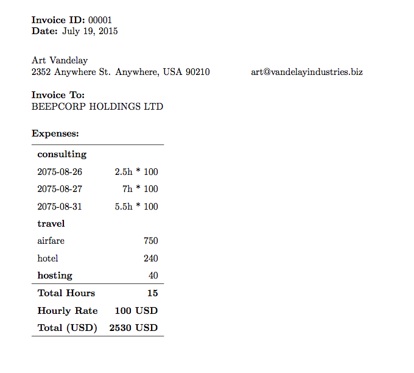

# @bret/invoicer
[](https://www.npmjs.com/package/@bret/invoicer)
[](https://github.com/bcomnes/invoicer/actions)
[](https://coveralls.io/github/bcomnes/invoicer?branch=master)
[](https://npmtrends.com/@bret/invoicer)

generate PDF invoices from json. Maintenance fork of [substack/invoicer](https://www.npmjs.com/package/invoicer).

```
npm install @bret/invoicer
```

# example

``` json
[
  {"title":"consulting","rate": 100, "hours":[
    {"date":"2075-08-27","hours":2.5},
    {"date":"2075-08-28","hours":7},
    {"date":"2075-09-01","hours":5.5}
  ]},
  {"title":"travel","items":[
    {"title":"airfare","amount":750},
    {"title":"hotel","amount":240}
  ]},
  {"title":"hosting","amount":40}
]
```

``` bash
$ invoicer -r 'BEEPCORP HOLDINGS LTD' -e expenses.json -o invoice.pdf
```

The first time you run invoicer you will be prompted to enter your name,
address, email, and currency.

Once invoicer finishes you will have a fancy `invoice.pdf`.

_How_ fancy an invoice? Glad you asked:



# usage

```
usage: invoicer -r 'BEEPCORP HOLDINGS LTD' -e expenses.json -o invoice.pdf

  -r, --rcpt      invoice receipient
  -e, --expenses  expense sheet. If not given or '-', read from stdin.
  -o, --output    generate a pdf for this filename
  -m, --mode      mode to use (implied by the extension in -o, otherwise "text")
  -t, --template  use a custom LaTeX template
  -c FILE         config file (default: ~/.config/invoicer/config.json)

Here is an example expenses.json file:

  [
    {"title":"consulting","rate": 100, "hours":[
      {"date":"2075-08-27","hours":2.5},
      {"date":"2075-08-28","hours":7},
      {"date":"2075-09-01","hours":5.5}
    ]},
    {"title":"travel","items":[
      {"title":"airfare","amount":750},
      {"title":"hotel","amount":240}
    ]},
    {"title":"hosting","amount":40}
  ]

For each `row` in the json array, `invoicer` only looks for:

* `row.rate` and a `row.hours` array
* `row.items` array
* `row.amount`

Each row should have a title.
```

# install

You'll need the `pdflatex` command first from
[texlive](http://www.tug.org/texlive/acquire-netinstall.html).

If you're on a debianish system you can do: `sudo apt-get install texlive`.

On windows you can use [w32tex](http://w32tex.org/).

Once all that is out of the way, install with [npm](https://npmjs.org) to get
the `invoicer` command:

```
npm install -g @bret/invoicer
```

# license

MIT
